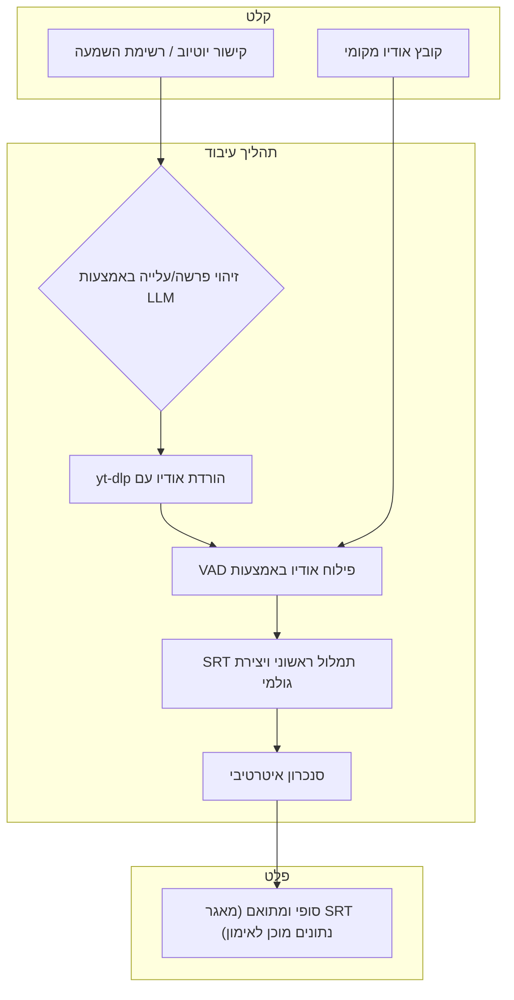

# ‫התאמת נתוני קריאה בתורה לאימון‬

[English](README.md)

<p align="center">
  
  
</p>

<p align="center">
‫מערכת אוטומטית ליצירת מאגרי נתונים (datasets) איכותיים ומתואמי-זמן, המיועדים לאימון מודלי זיהוי דיבור (ASR) לקריאה בתורה עם טעמי המקרא.‬
</p>

‫פרויקט זה, שפותח על ידי אביב שם-טוב, נותן מענה לצוואר בקבוק קריטי בפיתוח מודלי זיהוי דיבור לטקסטים מקראיים: המחסור במאגרי מידע גדולים, מפולחים ומדויקים. פיתחנו מערכת אוטומטית מקיפה שהופכת הקלטות אודיו ארוכות של קריאה בתורה למקטעים קצרים ומתואמים באופן מדויק, המתאימים לאימון מודלים כמו Whisper.‬

‫המערכת הצליחה להרחיב את מאגר הנתונים שלנו מ-123 ל-**337 שעות**, תוך שילוב מגוון רחב של נוסחים וקוראים. הרחבה זו הובילה לשיפור דרמטי בביצועי המודל: ציון ה-F1 לזיהוי טעמים בנוסח אשכנז עלה מ-**0.153 ל-0.842**, ושיעור שגיאות המילים (WER) צנח מ-**91% ל-7.3%** בלבד.‬

---

## 📜 ‫תוכן עניינים‬

- [‫תכונות מרכזיות‬](#-תכונות-מרכזיות)
- [‫הבעיה‬](#-הבעיה)
- [‫תהליך העבודה האוטומטי‬](#-תהליך-העבודה-האוטומטי)
- [‫תוצאות והשפעה‬](#-תוצאות-והשפעה)
- [‫מבנה הריפוזיטורי‬](#-מבנה-הריפוזיטורי)
- [‫התחלה מהירה‬](#-התחלה-מהירה)
  - [‫דרישות קדם‬](#דרישות-קדם)
  - [‫התקנה‬](#התקנה)
  - [‫הגדרות‬](#-הגדרות)
- [‫אופן השימוש‬](#-אופן-השימוש)
  - [‫1. איסוף נתונים מיוטיוב‬](#1-איסוף-נתונים-מיוטיוב)
  - [‫2. הרצת תהליך העיבוד המרכזי‬](#2-הרצת-תהליך-העיבוד-המרכזי)
  - [‫3. ניתוח מאגר הנתונים‬](#3-ניתוח-מאגר-הנתונים)
- [‫תרומה לפרויקט‬](#-תרומה-לפרויקט)
- [‫תודות‬](#-תודות)

---

## ✨ ‫תכונות מרכזיות‬

- **🤖 ‫איסוף אוטומטי מיוטיוב‬**: ‫שימוש במודל שפה גדול (LLM) מבוסס Gemini לזיהוי, סיווג (פרשה, עלייה, נוסח) והורדה אוטומטית של סרטוני קריאה בתורה מיוטיוב.‬
- **🗣️ ‫פילוח חכם מבוסס VAD‬**: ‫חיתוך חכם של הקלטות אודיו ארוכות למקטעים של פחות מ-30 שניות באמצעות זיהוי הפסקות טבעיות בדיבור, למניעת חיתוך באמצע מילה.‬
- **🔄 ‫התאמת טקסט איטרטיבית‬**: ‫תהליך חדשני ורב-שלבי המגשר בהדרגה על הפער בין התמלול הגולמי של Whisper לבין הטקסט המקראי המנוקד ובעל הטעמים.‬
- **⚡ ‫עיבוד מקבילי מבוסס GPU‬**: ‫המערכת מותאמת למהירות ומנצלת מספר מעבדים גרפיים (GPU) ועיבוד באצוות (batch processing) לתמלול והתאמה יעילים של נתונים.‬
- **📊 ‫כלים לבקרת איכות וניתוח‬**: ‫כולל סקריפטים לניתוח קבצי SRT, זיהוי חריגות, ובקרת איכות, כולל מחיקה של הלוסינציות נפוצות של המודל (כמו "תודה רבה").‬
- **🗂️ ‫ניהול נתונים מובנה‬**: ‫שמירה על סדר וארגון של קבצי המקור והקבצים המעובדים במבנה תיקיות ברור וצפוי, המקל על ניהול הפרויקט ושחזור תוצאות.‬

---

## 🎯 ‫הבעיה‬

‫אימון מודלי ASR מודרניים דורש קטעי אודיו קצרים (בדרך כלל מתחת ל-30 שניות) עם תמלול מדויק. רוב ההקלטות הזמינות של קריאה בתורה הן ארוכות ומכסות עליות שלמות או פרשות. פילוח ידני של הקלטות אלו ותיאום מדויק שלהן עם הטקסט המסורתי — הכולל ניקוד וטעמים — הוא תהליך איטי, מפרך ומועד לטעויות. מחסור זה בנתונים היווה את המכשול העיקרי בדרך לשיפור מודלים לזיהוי קריאה בתורה.‬

---

## 🛠️ ‫תהליך העבודה האוטומטי‬

‫הפתרון שלנו הוא מערכת מקצה-לקצה הממכנת את כל תהליך הכנת הנתונים. הארכיטקטורה היא כדלקמן:‬



1.  **‫איסוף נתונים‬**: ‫התהליך יכול להתחיל מ**קישור יוטיוב** או מ**קובץ אודיו מקומי**.‬
    -   ‫אם סופק קישור יוטיוב, מודל LLM (Gemini) מנתח את המטא-דאטה שלו כדי לזהות את התוכן, ו-`yt-dlp` מוריד את האודיו.‬
2.  **‫פילוח אודיו (`audio_to_srt.py`)‬**: ‫קובץ האודיו הארוך מפולח למקטעים קצרים באמצעות אלגוריתם VAD, המבטיח חיתוך בהפסקות טבעיות.‬
3.  **‫תמלול ראשוני (`audio_to_srt.py`)‬**: ‫כל מקטע קצר מועבר למודל Whisper ליצירת תמלול "גולמי" (`_RAW.srt`), בעל תזמון מדויק אך טקסט פשוט.‬
4.  **‫התאמת טקסט איטרטיבית (`main.py`)‬**: ‫ליבת החדשנות בפרויקט. במקום התאמה ישירה אחת, אנו משתמשים ב-`WhisperTimeSync.jar` כדי ליישר בהדרגה את ה-SRT הגולמי מול גרסאות מורכבות יותר ויותר של הטקסט המקראי, עד להשגת התאמה מושלמת.‬
5.  **‫פלט סופי ואחסון‬**: ‫התוצר הסופי הוא קובץ SRT מתואם באופן מושלם עם הטקסט המסורתי, המשמש כמאגר הנתונים המוכן לאימון.‬

---

## 📈 ‫תוצאות והשפעה‬

‫תהליך העבודה האוטומטי איפשר הרחבה מאסיבית של מאגר הנתונים שלנו וקפיצת מדרגה בביצועי המודל.‬

**‫הרחבת מאגר הנתונים:‬**

| ‫מאגר נתונים‬ | ‫לפני‬ | ‫אחרי‬ | ‫גידול‬ |
| :-------- | :----: | :---: | :------: |
| **‫שעות‬** | 123 | **337** | **+174%** |

**‫ביצועי המודל (נוסח אשכנז - מודל `V3-turbo`):‬**

| ‫מדד‬ | ‫לפני (מאגר בסיסי)‬ | ‫אחרי (מאגר מורחב)‬ | ‫שיפור‬ |
| :----------- | :-------------------: | :----------------------: | :---------: |
| **F1 Score** | 0.153 | **0.842** | **+450%** |
| **WER** | 91.0% | **7.3%** | **-92%** |

‫תוצאות אלו מאששות את יעילות המערכת ביצירת נתונים באיכות גבוהה ובשיפור משמעותי של יכולות זיהוי הקריאה בתורה.‬

---

## 📂 ‫מבנה הריפוזיטורי‬

```
.
├── automatic using WhisperTimeSync/
│   ├── main.py                   # ‫הסקריפט המרכזי המריץ את תהליך העיבוד‬
│   ├── audio_to_srt.py           # ‫אחראי על פילוח VAD ותמלול ראשוני עם Whisper‬
│   ├── get_data_from_youtube.py  # ‫איסוף נתונים אוטומטי מיוטיוב באמצעות LLM‬
│   ├── create_steps_files.py     # ‫יוצר קבצי טקסט ביניים להתאמה איטרטיבית‬
│   ├── nikud_and_teamim.py       # ‫כלי עזר לעיבוד טקסט עברי (ניקוד, טעמים)‬
│   ├── analyze_srt.py            # ‫סקריפט לניתוח מאגר הנתונים ובקרת איכות‬
│   ├── parasha_matcher.py        # ‫מתאים ומתקנן שמות של פרשות‬
│   └── WhisperTimeSync/          # ‫מכיל את כלי ההתאמה החיצוני ב-Java‬
│
├── semi automatic cut/
│   └── cut audio.py              # ‫כלי GUI חצי-אוטומטי ישן יותר לפילוח‬
│
├── delete_files_with_hilucinations.py # ‫סקריפט לניקוי הלוסינציות של Whisper מהמאגר‬
└── README.md
```

---

## 🚀 ‫התחלה מהירה‬

### ‫דרישות קדם‬

- **Python 3.10+**
- **Java** (‫נדרש להרצת `WhisperTimeSync.jar`‬)
- **FFmpeg** (‫נדרש על ידי `yt-dlp` ו-`librosa`‬)
- **‫מפתח API של Google Gemini‬** ‫עבור סקריפט איסוף הנתונים האוטומטי.‬

### ‫התקנה‬

1.  **‫שכפול הריפוזיטורי:‬**
    ```bash
    git clone <repository-url>
    cd <repository-directory>
    ```

2.  **‫התקנת תלויות פייתון:‬**
    ```bash
    pip install torch transformers datasets librosa soundfile srt tqdm google-generativeai yt-dlp
    ```

3.  **‫הגדרת מפתח API:‬**
    ‫הגדר את מפתח ה-API של Gemini כמשתנה סביבה:‬
    ```bash
    export GEMINI_API_KEY="YOUR_API_KEY"
    ```

4.  **WhisperTimeSync:**
    ‫ודא שהקובץ `WhisperTimeSync.jar` נמצא בנתיב `automatic using WhisperTimeSync/WhisperTimeSync/distrib/`.‬

### ⚙️ ‫הגדרות‬

**‫חשוב:‬** ‫לפני הרצת הסקריפטים, עליך להגדיר את נתיבי הקבצים כך שיתאימו לסביבה המקומית שלך. נכון לעכשיו, הנתיבים מקודדים ישירות בקבצים.‬

-   ‫בקובץ `automatic using WhisperTimeSync/main.py`, שנה את משתני הנתיבים הבאים בראש הקובץ:‬
    -   `base_dir`
    -   `text_dir`
    -   `raw_srt_storage_base`
    -   `whisperTimeSync`
-   ‫בקובץ `automatic using WhisperTimeSync/get_data_from_youtube.py`, שנה את הנתיב `dataset_dir` בפונקציה `process_single_video` ובפונקציות רלוונטיות אחרות.‬
-   ‫בקובץ `delete_files_with_hilucinations.py`, שנה את `raw_srt_base_dir` ו-`base_dir` בתחתית הסקריפט.‬

---

## ‫אופן השימוש‬

### ‫1. איסוף נתונים מיוטיוב‬

‫ניתן להריץ את הסקריפט `get_data_from_youtube.py` כדי להוריד נתוני אודיו חדשים. הוא תומך במצב אינטראקטיבי ואוטומטי.‬

-   **‫מצב אינטראקטיבי‬**: ‫מנחה אותך בתהליך עיבוד של סרטון בודד או רשימת השמעה, עם בקשות לאישור.‬
    ```bash
    python "automatic using WhisperTimeSync/get_data_from_youtube.py"
    ```
-   **‫מצב אוטומטי‬**: ‫מעבד רשימות השמעה שלמות או קובץ קישורים ללא התערבות משתמש, אידיאלי לאיסוף נתונים בקנה מידה גדול.‬

### ‫2. הרצת תהליך העיבוד המרכזי‬

‫הסקריפט `main.py` הוא ליבת הפרויקט. הוא מוצא אוטומטית קבצי אודיו שטרם עובדו ומריץ את תהליך ההתאמה המלא.‬

1.  ‫לאחר הגדרת הנתיבים, מקם את קבצי האודיו שלך בתיקיות המתאימות תחת `base_dir` שהגדרת.‬
2.  ‫מקם את קבצי הטקסט התואמים בתוך `text_dir` שהגדרת.‬
3.  **‫הרץ את הסקריפט הראשי:‬**
    ```bash
    python "automatic using WhisperTimeSync/main.py"
    ```
    ‫הסקריפט יעבד את כל הקבצים החדשים, ידלג על קיימים, וישמור את קבצי ה-SRT המתואמים באותה תיקייה של קבצי האודיו.‬

### ‫3. ניתוח מאגר הנתונים‬

‫השתמש ב-`analyze_srt.py` כדי לבדוק את איכות מאגר הנתונים שיצרת.‬

```bash
# ‫דוגמה: מצא קבצים עם כתוביות שאורכן עולה על 150 תווים‬
python "automatic using WhisperTimeSync/analyze_srt.py" --dir <your_base_dir>/MyDataset/ --recursive --length-threshold 150
```

---

## 🤝 ‫תרומה לפרויקט‬

‫נשמח לקבל תרומות! אם יש לכם הצעות לשיפורים או שמצאתם בעיות, אנא פתחו issue או שלחו pull request.‬

---

## 🙏 ‫תודות‬

- **OpenAI** ‫על מודל ה-Whisper.‬
- **Google** ‫על מודל ה-Gemini.‬
- **‫ספריא (Sefaria)‬** ‫על אספקת טקסט המקור המקראי דרך ה-API שלהם.‬
- ‫צוות **yt-dlp** על כלי הורדת הווידאו העוצמתי שלהם.‬
- **EtienneAb3d** ‫על הכלי [WhisperTimeSync](https://github.com/EtienneAb3d/WhisperTimeSync), שהיווה רכיב מפתח בתהליך ההתאמה שלנו.‬